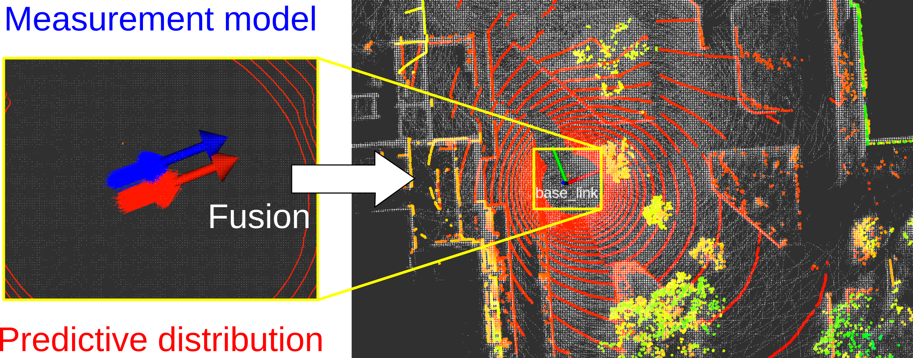

# mcl3d_ros

`mcl3d_ros` 是一个基于 ROS 2 的 3D LiDAR 蒙特卡洛定位包。它使用预先构建好的点云地图进行定位：先把 PCD 地图转换成 3D distance field，再在在线定位时用这个距离场完成粒子权重计算、距离场优化和重要性采样融合。

当前工作区基于原始 `mcl3d_ros` 的 ROS 2 版本，并额外加入了一个可选的结构观测先验 `StructureMap`。该模块会从地图和当前 LiDAR 点云中提取局部结构/拓扑描述子，并作为软权重项调整粒子权重。


## 核心思路

这个项目不是每一帧都直接做点云最近邻匹配，而是先把地图点云转换成距离场。在线定位时，任意一个 LiDAR 点经过某个候选位姿变换到地图坐标系后，都可以快速查询：

```text
这个点距离最近的地图点有多远？
```

这个距离会被用于两类计算：

- 粒子滤波中的观测似然；
- 距离场 scan matching 优化中的残差。

默认定位模式会融合这两类结果：普通 MCL 粒子保留多假设能力，距离场优化结果附近采样出的优化粒子提供快速局部收敛能力。

原始方法可参考：

```bibtex
@misc{akai_arxiv2023_mcl3d,
  url = {https://arxiv.org/abs/2303.00216},
  author = {Akai, Naoki},
  title = {Efficient Solution to {3D-LiDAR}-based {Monte Carlo} Localization with Fusion of Measurement Model Optimization via Importance Sampling},
  publisher = {arXiv},
  year = {2023}
}
```



## 项目结构

```text
mcl3d_ros/
  include/mcl3d_ros/
    DistanceField.h     距离场地图表示、保存、加载和查询
    MCL.h               主定位算法接口
    StructureMap.h      可选结构观测先验
    IMU.h               IMU 姿态更新辅助类
    Pose.h              6 自由度位姿容器
    Particle.h          粒子位姿和权重
    Point.h             3D 点容器
  src/
    pc_to_df.cpp        从 PCD 或 PointCloud2 构建距离场地图
    distance_field.cpp  距离场实现
    mcl_node.cpp        ROS 2 定位节点
    mcl.cpp             MCL、优化、融合、重采样主逻辑
    structure_map.cpp   结构描述子地图和结构似然
    sensor_points_merger.cpp  多传感器点云合并
    imu.cpp             IMU 姿态更新实现
  launch/
    pc_to_df.launch.py  距离场地图生成
    mcl.launch.py       定位启动文件
  rviz/
    mcl3d_ros.rviz      RViz 可视化配置
```

## 可执行节点

该包会编译出 3 个可执行程序：

- `pc_to_df`：把 PCD 文件或 `sensor_msgs/msg/PointCloud2` 地图话题转换成距离场二进制地图和 YAML 元数据。
- `mcl`：主 3D LiDAR 定位节点。
- `sensor_points_merger`：根据 TF 外参把多个点云传感器合并成一个点云。

## 安装

```bash
cd /your/ros2_ws/src
git clone https://github.com/NaokiAkai/mcl3d_ros.git
cd /your/ros2_ws
rosdep install --from-paths src --ignore-src -r -y
colcon build --packages-select mcl3d_ros
source install/setup.bash
```

当前分支面向 ROS 2 Humble。

## 快速使用

### 1. 构建距离场地图

先准备目标环境的 `.pcd` 点云地图，然后运行：

```bash
ros2 launch mcl3d_ros pc_to_df.launch.py \
  pcd_file:=/your/pcd/file.pcd \
  yaml_file_path:=/your/yaml/dist_map.yaml \
  map_file_name:=dist_map.bin
```

该命令会生成：

- `dist_map.bin`：距离场二进制地图；
- `dist_map.yaml`：地图原点、尺寸、分辨率等元数据。

也可以从 ROS 点云话题构建距离场：

```bash
ros2 launch mcl3d_ros pc_to_df.launch.py \
  from_pcd_file:=false \
  map_points_name:=/map_points \
  yaml_file_path:=/your/yaml/dist_map.yaml \
  map_file_name:=dist_map.bin
```

当前定位器只直接支持由 `pc_to_df` 生成的距离场地图格式。

### 2. 运行定位

```bash
ros2 launch mcl3d_ros mcl.launch.py \
  map_yaml_file:=/your/yaml/dist_map.yaml
```

默认 LiDAR 输入话题是 `/velodyne_points`。

### 3. RViz 可视化

```bash
rviz2 -d install/mcl3d_ros/share/mcl3d_ros/rviz/mcl3d_ros.rviz
```

## 数据流

离线建图：

```text
PCD 地图或 /map_points
  -> pc_to_df
  -> DistanceField
  -> dist_map.yaml + dist_map.bin
```

在线定位：

```text
/velodyne_points + 距离场地图
  -> mcl 节点
  -> 位姿预测
  -> LiDAR 似然计算 / 距离场优化
  -> 粒子融合与重采样
  -> /mcl_pose, /opt_pose, particles, TF
```

## 定位模式

通过 `localization_mode` 设置：

| 模式 | 含义 |
| --- | --- |
| `0` | 仅使用 measurement model optimization，类似基于距离场的 scan matching。 |
| `1` | 标准粒子滤波。 |
| `2` | 距离场优化与 MCL 通过重要性采样融合，默认模式。 |
| `3` | EKF 融合，把优化位姿作为观测更新。 |

## 观测模型

通过 `measurement_model_type` 设置：

| 类型 | 含义 |
| --- | --- |
| `0` | 直接距离误差，仅用于优化模式。 |
| `1` | 正态分布观测模型。 |
| `2` | Likelihood field model。 |
| `3` | Class conditional measurement model，默认模式。 |

## ROS 接口

默认订阅：

| 话题 | 类型 | 说明 |
| --- | --- | --- |
| `/velodyne_points` | `sensor_msgs/msg/PointCloud2` | 主 3D LiDAR 输入 |
| `/odom` | `nav_msgs/msg/Odometry` | 可选里程计输入 |
| `/gpsimu_driver/imu_data` | `sensor_msgs/msg/Imu` | 可选 IMU 输入 |
| `/initialpose` | `geometry_msgs/msg/PoseWithCovarianceStamped` | 可选初始位姿重置 |

默认发布：

| 话题 | 类型 | 说明 |
| --- | --- | --- |
| `/mcl_pose` | `geometry_msgs/msg/PoseWithCovarianceStamped` | 最终定位结果 |
| `/opt_pose` | `geometry_msgs/msg/PoseWithCovarianceStamped` | 距离场优化结果 |
| `/particles` | `geometry_msgs/msg/PoseArray` | MCL 普通粒子 |
| `/optimized_particles` | `geometry_msgs/msg/PoseArray` | 优化位姿附近采样出的粒子 |
| `/aligned_points_opt` | `sensor_msgs/msg/PointCloud` | 优化中使用的降采样点云 |
| `/df_map_points` | `sensor_msgs/msg/PointCloud` | 从距离场恢复出的地图点 |

默认 TF 行为：

- `use_odom_tf:=false` 时发布 `map -> base_link`；
- `use_odom_tf:=true` 时发布 `map -> odom`；
- 开启 `broadcast_tf` 时额外发布 `map -> opt_pose`。

## 关键参数

地图和坐标系：

| 参数 | 默认值 | 说明 |
| --- | --- | --- |
| `map_yaml_file` | `/tmp/dist_map.yaml` | 距离场 YAML 文件 |
| `map_frame` | `map` | 全局地图坐标系 |
| `odom_frame` | `odom` | 里程计坐标系 |
| `base_link_frame` | `base_link` | 机器人本体坐标系 |
| `laser_frame` | `velodyne` | LiDAR 坐标系 |
| `base_link_2_laser` | `[0, 0, 0, 0, 0, 0]` | base 到 LiDAR 的静态外参 |

粒子滤波：

| 参数 | 默认值 | 说明 |
| --- | --- | --- |
| `particle_num` | `1000` | 普通粒子数量 |
| `optimized_particle_num` | `1000` | 融合模式中的优化粒子数量 |
| `random_particle_rate` | `0.1` | 重采样时注入随机粒子的比例 |
| `resample_threshold` | `0.5` | 有效粒子数重采样阈值比例 |
| `initial_pose` | `[0, 0, 0, 0, 0, 90]` | 初始位姿，角度单位为 degree |
| `initial_noise` | `[0.1, 0.1, 0.1, 0.05, 0.05, 0.05]` | 初始粒子噪声 |

LiDAR 似然和优化：

| 参数 | 默认值 | 说明 |
| --- | --- | --- |
| `sensor_points_num` | `1000` | 参与似然计算的点数 |
| `voxel_leaf_size` | `1.0` | 优化前点云降采样体素大小 |
| `z_hit` | `0.9` | 命中项权重 |
| `z_rand` | `0.05` | 随机观测项权重 |
| `z_max` | `0.05` | 最大量程项权重 |
| `var_hit` | `0.4` | 命中项方差 |
| `range_max` | `120.0` | LiDAR 最大量程 |
| `opt_max_iter_num` | `30` | 优化最大迭代次数 |
| `opt_max_error` | `0.5` | 优化中允许的最大残差 |
| `convergence_threshold` | `0.02` | 优化收敛阈值 |

## 结构观测先验

当前工作区包含可选结构先验，可通过以下方式开启：

```bash
ros2 launch mcl3d_ros mcl.launch.py \
  map_yaml_file:=/your/yaml/dist_map.yaml \
  use_structure_observation:=true
```

开启后，系统会从全局地图中提取结构候选区域。候选区域由 BEV 占据变化、密度变化、高度复杂度等指标筛选得到。每个区域会保存一个 8 维局部体素拓扑描述子。在线运行时，当前 LiDAR 点云也会生成一个局部描述子，然后每个粒子根据其附近地图结构和当前观测结构的相似度获得一个软结构似然：

```text
w_i = L_lidar * L_structure^alpha
```

结构项只调整粒子权重，不会硬删除粒子。

相关参数：

| 参数 | 默认值 | 说明 |
| --- | --- | --- |
| `use_structure_observation` | `false` | 是否启用结构观测权重 |
| `use_structure_adaptive_alpha` | `true` | 几何权重区分度弱时自适应增强结构项 |
| `structure_alpha` | `0.5` | 结构似然指数 |
| `structure_sigma` | `1.0` | 描述子似然带宽 |
| `structure_min_likelihood` | `0.05` | 结构似然下限，避免权重被压成 0 |
| `structure_bev_resolution` | `0.3` | BEV 栅格分辨率 |
| `structure_voxel_size` | `0.3` | 拓扑描述子的体素大小 |
| `structure_local_radius` | `6.0` | 局部结构区域半径 |
| `structure_candidate_score_threshold` | `0.35` | 结构候选区域分数阈值 |
| `structure_candidate_min_distance` | `2.0` | 候选区域之间的最小距离 |
| `structure_min_region_points` | `30` | 生成描述子所需的最少点数 |

## 注意事项

- 定位器可以在没有里程计的情况下运行；开启 `use_odom:=true` 后，里程计会用于运动预测。
- 代码中有 IMU 订阅和姿态更新辅助逻辑，但当前主 MCL 预测/更新流程没有实际使用 IMU 修正。
- 地图需要由 `pc_to_df` 生成，当前不直接加载其他地图格式。

## License

This software is subject to the [Apache 2.0](http://www.apache.org/licenses/LICENSE-2.0.html) License.
